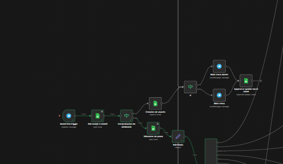
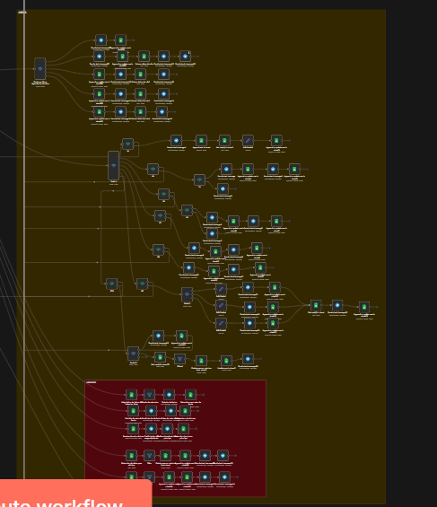
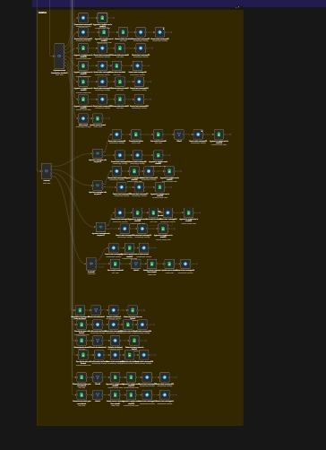

# Caso de estudio — Documentación del workflow (n8n)

> Workflow n8n: **“Caso de estudio”** 

## 1) Objetivo del workflow

Este flujo implementa un bot conversacional en **Telegram** (AgendaBot) con menú numérico, persistencia de estado en **Google Sheets** y navegación por “pantallas/pasos” para ejecutar acciones (Agenda/Citas, Tareas, Recordatorios, Hábitos, Listas, etc.).
El bot guía al usuario, valida entradas y guarda el progreso de conversación en una hoja **SESSION**.

---

## 2) Requisitos

### n8n

* Workflow con un **Telegram Trigger** (entrada de mensajes).
* Nodos de **Telegram** para enviar mensajes al usuario.

### Google Sheets

* Documento: **AgendaBot_DB** 
* Se usan (mínimo visible en el JSON):

  * Hoja **USUARIOS** 
  * Hoja **SESSION** 
  * Hoja **CITAS** 

---

## 3) Credenciales

* **Telegram account** (Telegram API credentials) 
* **Google Sheets account** (OAuth2) 

---

## 4) Arquitectura general (alto nivel)

1. **Entrada**: Telegram Trigger recibe cada mensaje del usuario. 
2. **Carga/validación del usuario**:

   * Busca el usuario en **USUARIOS** filtrando por `telegram_user = chat.id`. 
   * Si no existe, lo crea en **USUARIOS** con rol “User” y permitido “Activo”. 
3. **Menú principal**:

   * Si `rol == "Admin"` envía menú con opción “8. Administrador”.  
   * Si no es admin, envía menú normal. 
4. **Persistencia de sesión**:

   * Guarda/actualiza en **SESSION** la pantalla/paso actual del usuario. 
5. **Enrutamiento por estado** (máquina de estados):

   * Lee `paso_actual`/`pantalla_actual` desde **SESSION** y enruta con el switch **Identificador de pasos**. 
6. **Enrutamiento por opción numérica**:

   * Captura el mensaje del usuario como `Respuesta`. 
   * Switch **Opciones Menu Principal** compara `Respuesta` contra “0..9”. 

---

## 5) Modelo de estado (SESSION)

La hoja **SESSION** se usa para recordar “dónde va” el usuario en la conversación:

Campos visibles/configurados:

* `telegram_user` (llave para match) 
* `pantalla_actual` 
* `paso_actual` 
* `timestamp_ultima_interaccion` 

En flujos de cita también aparece:

* `datos_parciales` (controla subpasos del wizard) 
* `id_temporal` (id de la entidad en curso, por ejemplo una cita) 

---

## 6) Menú principal

### Mensaje de menú (Usuario normal)

Incluye opciones **0..7** (Ayuda, Agenda, Tareas, Recordatorios, Hábitos, Listas, Reportes, Configuración). 

### Mensaje de menú (Admin)

Incluye lo anterior y además **8. Administrador**. 

### Switch: “Opciones Menu Principal”

Este nodo toma `Respuesta` (texto entrante) y enruta según el número digitado. Se ven condiciones para “7”, “8”, “9” y una regla de “respuesta incorrecta” basada en `includes([...])`. 

---

## 7) Enrutamiento por “pantalla/paso” (Identificador de pasos)

El switch **Identificador de pasos** decide a qué subflujo ir según el estado en SESSION:

Valores observables:

* `menu_principal` 
* `helpers` 
* `cita` (menú de citas) 
* `agendando_cita` 
* `editando_agenda`, `reagendando_cita`, `rehorificando_cita`, `eliminar_cita`, `completar_cita` 
* `tareas`, `habitos`, `listas`, `reportes`, `configuracion`, `admin` 

---

## 8) Subflujo: Agendar cita (wizard por pasos)

Se ve un flujo tipo “Paso X de 6” para recolectar datos y guardarlos progresivamente en **CITAS**, usando `datos_parciales` para saber qué preguntar después.

### Persistencia incremental en CITAS

Ejemplo (captura de fecha temporal):

* Guarda en **CITAS**: `id_cita`, `telegram_User`, `cita_fecha_tmp`, `timestamp_creacion`. 

Ejemplo (captura de hora):

* Actualiza en **CITAS**: `hora_tmp` para el `id_cita` en curso. 

### Control del paso actual

Para avanzar el wizard, actualiza SESSION:

* `paso_actual = "agendando_cita"`
* `datos_parciales = "agendando_cita_paso3"` (ejemplo)
* `pantalla_actual = "agendando_cita"` 

### Switch “Switch” (subpasos de agendando_cita)

Enruta por `datos_parciales`:

* `agendando_cita_paso1` … `agendando_cita_paso7` 

### Mensajes al usuario (ejemplo paso 2/6)

Pregunta hora con formato 24h y opción 9 para cancelar: 

---

## 9) Gestión de usuarios (USUARIOS)

### Lectura

Busca por `telegram_user` usando el `chat.id`: 

### Creación

Si el usuario no existe, se crea con:

* `telegram_user = chat.id`
* `nombre = first_name + last_name`
* `rol = "User"`
* `permitido = "Activo"` 

---

## 10) Puntos críticos (para mantenimiento)

* **Máquina de estados**: todo depende de mantener coherentes `pantalla_actual`, `paso_actual` y (cuando aplique) `datos_parciales`. 
* **Wizard de citas**: el avance está acoplado a valores exactos como `agendando_cita_pasoN`. Si uno no coincide, el usuario se queda “colgado” en el paso. 
* **Menús numéricos**: la entrada se toma desde `message.text` y se asigna a `Respuesta`; cualquier validación debe basarse en esa variable. 

---

## 11) Diagrama rápido (Mermaid)

```mermaid
flowchart TD
  A[Telegram Trigger] --> B[Buscar usuario en USUARIOS]
  B -->|No existe| C[Crear usuario en USUARIOS]
  B --> D[Leer SESSION (Ubicacion de pasos)]
  D --> E[Set Respuesta = message.text]
  E --> F[Identificador de pasos (switch)]
  F -->|menu_principal| G[Enviar menu / Opciones Menu Principal]
  F -->|agendando_cita| H[Switch subpasos agendando_cita_paso1..7]
  H --> I[Guardar CITAS / Actualizar SESSION]
```

---
## 12) pantallazos 



- validacion de si existe o no usuario



- logica completa de cita 


- logica de tareas



- logica de habitos 
  
