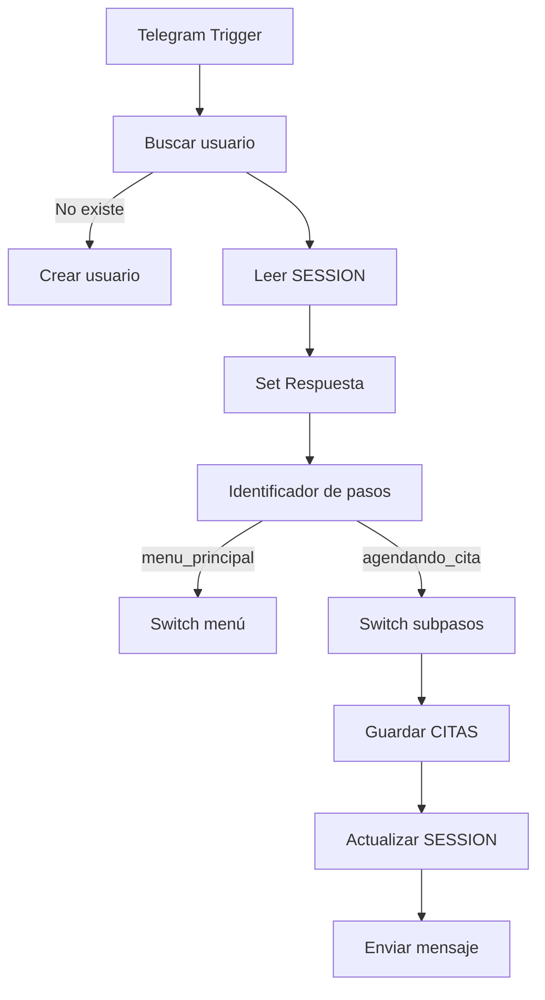

# Caso de estudio — Documentación del workflow (n8n)

> Workflow n8n: **“Caso de estudio” — AgendaBot**

---

## 1) Objetivo del workflow

Este flujo implementa un **bot conversacional en Telegram** que opera como una **máquina de estados persistente** usando **Google Sheets** como base de datos. Permite a los usuarios navegar por un menú numérico y ejecutar wizards (flujos guiados por pasos) para gestionar:

* 📅 **Citas / Agenda**
* ✅ **Tareas**
* ⏰ **Recordatorios**
* 🔁 **Hábitos**
* 📋 **Listas**
* 📊 **Reportes**
* ⚙️ **Configuración**
* 🛡️ **Administrador (solo rol Admin)**

El sistema recuerda el progreso del usuario incluso si este deja de escribir y vuelve más tarde, gracias a la persistencia en la hoja **SESSION**.

---

## 2) Stack tecnológico

| Componente                | Rol en la arquitectura                            |
| ------------------------- | ------------------------------------------------- |
| **Telegram Bot API**      | Interfaz conversacional con el usuario            |
| **n8n Community Edition** | Orquestación, lógica, validaciones y enrutamiento |
| **Google Sheets**         | Persistencia de datos y estado (DB sin backend)   |

> Este diseño simula un backend sin servidores dedicados, ideal para entornos educativos, MVPs y automatizaciones personales.

---

## 3) Requisitos

### n8n

* Workflow activo con:

  * **Telegram Trigger** (entrada de mensajes)
  * **Telegram Send Message** (salida)
  * **Google Sheets Nodes** (lectura y escritura)
  * **Switch** (enrutamiento por estado y opción)
  * **IF** (validaciones lógicas)

### Google Sheets

Documento: **AgendaBot_DB**

Hojas mínimas requeridas:

| Hoja                | Propósito                              |
| ------------------- | -------------------------------------- |
| **USUARIOS**        | Registro de usuarios, roles y permisos |
| **SESSION**         | Estado conversacional por usuario      |
| **CITAS**           | Base de datos de citas                 |
| **TAREAS**          | Base de datos de tareas                |
| **HABITOS**         | Base de datos de hábitos               |
| **LISTAS**          | Base de datos de listas                |
| **ITEMS_LISTA**     | Ítems por lista                        |
| **LOGS** (opcional) | Auditoría de acciones                  |

---

## 4) Credenciales

### Telegram

* Bot Token desde @BotFather
* Usado en:

  * Telegram Trigger
  * Telegram Send Message

### Google Sheets

* OAuth2 configurado en n8n
* Permisos:

  * Lectura y escritura sobre el documento AgendaBot_DB

---

## 5) Arquitectura general

### Flujo lógico

1. **Entrada**

   * Telegram Trigger recibe mensaje
2. **Identidad**

   * Busca usuario en USUARIOS
   * Si no existe → lo crea
3. **Estado**

   * Lee SESSION
4. **Parseo de entrada**

   * Guarda texto como `Respuesta`
5. **Enrutamiento por paso**

   * Switch `Identificador de pasos`
6. **Acción de negocio**

   * Menú / Wizard / Operación CRUD
7. **Persistencia**

   * Actualiza SESSION
   * Guarda datos en hoja correspondiente
8. **Salida**

   * Telegram responde

---

## 6) Filosofía de diseño

Este bot implementa un patrón tipo:

> **Finite State Machine (FSM) con almacenamiento externo**

Cada usuario tiene un “cursor” de conversación almacenado en Google Sheets. El flujo no depende de memoria interna de n8n.

### Beneficios

* Reinicio seguro del workflow
* Persistencia entre mensajes
* Soporte multiusuario
* Fácil auditoría

---

## 7) Modelo de datos

### 7.1 USUARIOS

| Campo         | Tipo   | Descripción         |
| ------------- | ------ | ------------------- |
| telegram_user | string | chat.id de Telegram |
| nombre        | string | Nombre del usuario  |
| rol           | string | User / Admin        |
| permitido     | string | Activo / Bloqueado  |

### 7.2 SESSION

| Campo                        | Tipo     | Descripción           |
| ---------------------------- | -------- | --------------------- |
| telegram_user                | string   | Llave primaria        |
| pantalla_actual              | string   | Módulo actual         |
| paso_actual                  | string   | Estado FSM            |
| datos_parciales              | string   | Subpaso del wizard    |
| id_temporal                  | string   | ID entidad en edición |
| timestamp_ultima_interaccion | datetime | Auditoría             |

### 7.3 CITAS

| Campo              | Tipo     | Descripción                     |
| ------------------ | -------- | ------------------------------- |
| id_cita            | string   | ID único                        |
| telegram_user      | string   | Usuario creador                 |
| fecha              | date     | Fecha final                     |
| hora               | time     | Hora final                      |
| nombre             | string   | A nombre de                     |
| motivo             | string   | Motivo                          |
| canal              | string   | Medio                           |
| estado             | string   | Activa / Cancelada / Completada |
| timestamp_creacion | datetime | Auditoría                       |

> Las columnas *_tmp se usan durante el wizard antes de confirmar.

---

## 8) Máquina de estados

### Estados globales (`paso_actual`)

| Estado         | Descripción      |
| -------------- | ---------------- |
| menu_principal | Menú principal   |
| helpers        | Ayuda            |
| cita           | Menú de citas    |
| agendando_cita | Wizard activo    |
| tareas         | Menú de tareas   |
| habitos        | Menú de hábitos  |
| listas         | Menú de listas   |
| reportes       | Menú de reportes |
| configuracion  | Ajustes          |
| admin          | Panel admin      |

### Subestados (`datos_parciales`)

Ejemplo en citas:

| Subestado            | Función        |
| -------------------- | -------------- |
| agendando_cita_paso1 | Captura fecha  |
| paso2                | Captura hora   |
| paso3                | Captura nombre |
| paso4                | Captura motivo |
| paso5                | Captura canal  |
| paso6                | Confirmación   |
| paso7                | Finalización   |

---

## 9) Enrutamiento central

### Switch: Identificador de pasos

Evalúa:

```js
$('Ubicacion de pasos').item.json.paso_actual
```

Y enruta hacia:

* Menú principal
* Submenús
* Wizards

### Switch: Opciones Menu Principal

Evalúa:

```js
$('Edit Fields').item.json.Respuesta
```

Y compara contra:

* "0" → Ayuda
* "1" → Citas
* "2" → Tareas
* ...
* "8" → Admin

Incluye validación negativa para respuestas inválidas.

---

## 10) Wizard de citas — Flujo detallado

### Paso 0 — Inicialización

* Genera `id_cita`
* Crea fila en CITAS
* Actualiza SESSION:

```text
paso_actual = agendando_cita
datos_parciales = agendando_cita_paso1
```

### Paso 1 — Fecha

* Usuario escribe fecha
* Valida formato
* Guarda en `cita_fecha_tmp`

### Paso 2 — Hora

* Usuario escribe HH:MM
* Valida
* Guarda en `hora_tmp`

### Paso 3 — Nombre

* Usuario escribe nombre completo

### Paso 4 — Motivo

* Usuario describe motivo

### Paso 5 — Canal

* Usuario indica medio (presencial, llamada, virtual)

### Paso 6 — Confirmación

* Muestra resumen
* Opciones:

  * 1 Confirmar
  * 2 Editar
  * 9 Cancelar

### Paso 7 — Finalización

* Normaliza datos
* Marca estado = Activa
* Limpia datos temporales
* Regresa al menú

---

## 11) Validaciones implementadas

| Validación              | Nodo                           |
| ----------------------- | ------------------------------ |
| Usuario existe          | IF: Comprobacion de existencia |
| Rol admin               | IF: rol == Admin               |
| Entrada numérica válida | Switch Menú                    |
| Fecha válida            | IF + DateTime.fromISO          |
| Hora válida             | Regex / DateTime               |
| Cancelación             | Respuesta == "9"               |

---

## 12) Manejo de errores

### Errores comunes

| Error                  | Causa                        | Solución                   |
| ---------------------- | ---------------------------- | -------------------------- |
| Flujo se queda colgado | `datos_parciales` incorrecto | Revisar valores exactos    |
| No entra al menú       | SESSION vacía                | Forzar `menu_principal`    |
| Duplica citas          | ID temporal no persistido    | Validar `id_temporal`      |
| Respuesta inválida     | Texto libre                  | Forzar validación numérica |

---

## 13) Seguridad

### Riesgos

* Edición manual en Sheets
* Usuarios falsificando chat.id

### Mitigaciones

* Validar `permitido == Activo`
* Logs de acción
* Rol Admin separado

---

## 14) Escalabilidad

### Limitaciones

* Google Sheets como DB
* Escritura concurrente limitada

### Mejoras futuras

* Migrar a:

  * Supabase
  * Firebase
  * PostgreSQL
* API intermedia

---

## 15) Logging y auditoría

Recomendado crear hoja:

**LOGS**

| timestamp | telegram_user | pantalla | accion | detalle |

Cada cambio de estado debe registrar:

* Entrada del usuario
* Nodo ejecutado
* Resultado

---

## 16) Convenciones

### Nombres de estados

Formato:

```text
<modulo>_<accion>_pasoN
```

Ejemplo:

```text
agendando_cita_paso3
```

---

## 17) Testing

### Casos mínimos

* Usuario nuevo
* Usuario Admin
* Cancelación en paso 1
* Entrada inválida
* Flujo completo de cita
* Simulación multiusuario

---

## 18) Diagrama completo



---

## 19) Guía de mantenimiento

* Nunca cambies nombres de estados sin actualizar los Switch
* Revisa esquemas de columnas al modificar Sheets
* Documenta cada nuevo paso en este archivo

---

## 20) Roadmap

* Recordatorios con CRON
* Dashboard web
* Exportación CSV
* Integración calendario

---

## 21) Referencia del workflow

Archivo base:

**Caso de estudio (58).json**
